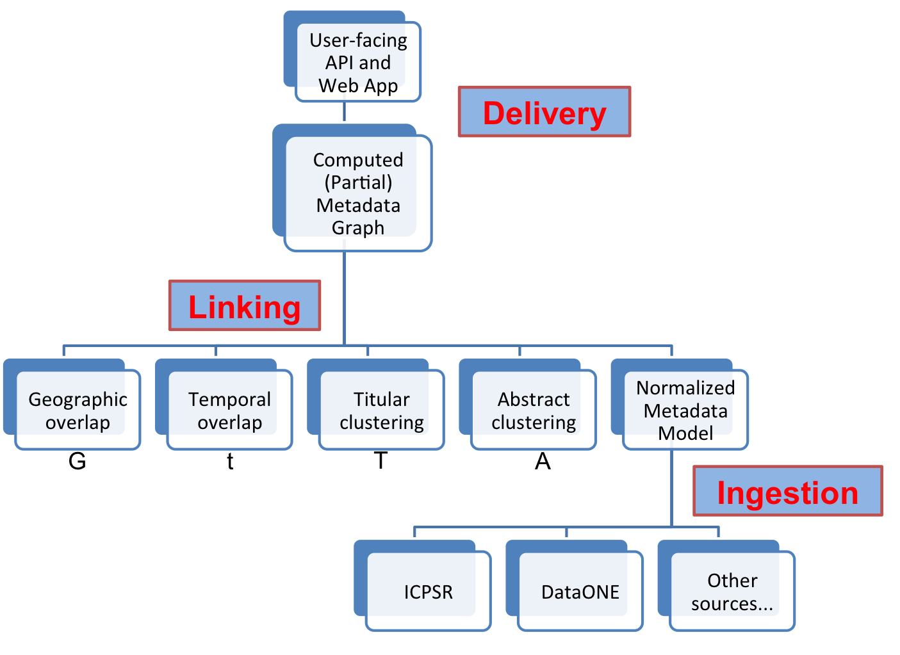

<!DOCTYPE html>
<html>
<head>
<!-- Latest compiled and minified CSS -->
<link rel="stylesheet" href="https://maxcdn.bootstrapcdn.com/bootstrap/3.3.5/css/bootstrap.min.css">

<!-- Optional theme -->
<link rel="stylesheet" href="https://maxcdn.bootstrapcdn.com/bootstrap/3.3.5/css/bootstrap-theme.min.css">

<title>Plan for Plenary</title>
</head>


<body>
<div class="container">
#  Final plan for P6 with an eye on the future

So far I've built a web interface where you can browse all ICPSR records. Search
is coming soon. It's
served by the API I'm developing to provide a REST interface to the 
linked data built on the backend. The
linked data will be built by normalizing XML metadata records from DataONE,
ICPSR, and more repositories into the future. These normalized records are
stored in a MongoDB collection; each document contains its own fulltext as a
field. MongoDB has built-in full-text search. It's a well-known database that
enables me to create
lean web apps. We ingest data into the database by writing a new parser
that extracts the normalized fields from each new metadata standard.

I believe in "rapid prototyping". It works for me personally as well as for teams. 
I was wondering how to build
a "mechanism to search across the pool of 
records for data sets that have the potential to be used together" by
"express(ing) metadata element correspondences at the schema level
between DDI-RDF and DataONE properties, harmonizing
geographic/temporal ranges and units." The technologies
suggested for use are still foreign to me.  Then I realized "Linked Data"
transcends standards or a given technology. So, as a first prototype, 
I'm going to build a linked interdisciplinary system based on the tools I know. 

Everything in keeping with the "open" part of linked open data, this software
has been open source from day 1 on github: 
[](https://github.com/mtpain/rda-lod.git). 


### Why another search interface? ICPSR and DataONE have their own.

<div class="row">

\begin{figure}
\begin{center}
\includegraphics[width=2in]{Richard_Stallman_-_Fete_de_lHumanite_2014_-_010.jpg}
\caption{Richard Stallman, founder of the Free Software Foundation}
\end{center}
\end{figure}

Because I didn't particularly like using either one, 
and in the long run I have to
build my own anyway to demonstrate my metadata system. Designing the front end
and the REST API simultaneously sets a goal for the back end--they are 
inextricably connected.
And to adapt a famous quote from the founder
of the Free Software Foundation Richard Stallman, 
I wanted to freely explore the metadata records in both ICPSR and DataONE
Repositories: "free like freedom, not free like free beer". 

A generic or pre-existing search interface won't
be able to serve my needs exactly as I move forward. 
I want the interface to be a publication like
a paper. We talk about software and data publications--let's make our own 
software publication from this work. 
Maybe someday people will write web apps for their work like some use
\LaTeX for journal papers. 


<p id="stallman-citation">
<em>
"Richard Stallman -
Fête de l'Humanité 2014 - 010" by Thesupermat - Own work. Licensed under CC
BY-SA 3.0 via Commons -
<a
href="https://commons.wikimedia.org/wiki/File:Richard_Stallman_-_F%C3%AAte_de_l%27Humanit%C3%A9_2014_-_010.jpg#/media/File:Richard_Stallman_-_F%C3%AAte_de_l%27Humanit%C3%A9_2014_-_010.jpg">https://commons.wikimedia.org/wiki/File:Richard_Stallman_-_F%C3%AAte_de_l%27Humanit%C3%A9_2014_-_010.jpg#/media/File:Richard_Stallman_-_F%C3%AAte_de_l%27Humanit%C3%A9_2014_-_010.jpg</a>
</em>
</p>
</div>

### Web app as a design tool

For me I also use a web interface as a design tool. Part of this project is
about a new application of linked data for an abstract system. But connecting
this system to a web front end forces it to take on an importatn o
non-abstractness it might never achieve otherwise. Serving the web app is a
REST API. When you run the software, `./startup.py` starts two servers: one for
the AngularJS front end and one for the Python Flask-based API backend.

Fielding's famed [thesis Chapter 5 on
Representational State
Transfer](https://www.ics.uci.edu/~fielding/pubs/dissertation/rest_arch_style.htm)
is popular for a reason: "the REST architectural style from other network-based
styles is its emphasis on a uniform interface between components." Furthermore,
it presents a clear split between "verbs" and "nouns", and their identification
in the existing HTTP scheme: verbs are built in and the main ones we need are
GET, POST, PUT, and DELETE. No need to introduce any more verbs. The nouns of
REST are _resources_. In the API I've built so far there are four resources:

1. `/api/metadata`
1. `/api/metadata/<string:_oid>`
1. `/api/metadata/<string:_oid>/raw`
1. `/api/metadata/search`

In my _innovation-decision_ process, a la Everett's _Diffusion of Innovations_, 
I recognize an anxiety to adopt SPARQL
because the community that wants that is so much smaller and there are less
resources for me or other developers to learn from. Alternatively, REST 
provides an answer to the same problem, but designed to fit the web.

### (Meta)Data Model, served by the API

Each new metadata standard or repository is ingested into a normalized metadata
model. This model is shown in its current, minimal form below.  This is the
actual model used in the _Model-View-Controller_ architecture of the REST API. I
also use it during the ingestion step: each metadata source gets its own
_parser_, contained in the 
[rda-lod/parsers](https://github.com/mtpain/rda-lod/tree/master/parsers)
directory. The metadata standard's parser converts a specific metadata standard
to the normalized version. All together, our metadata bubbles up to our web
in a hierarchy shown in the figure below. We also show below the actual
`NormalizedMetadata` class from
[`app/models.py`](https://github.com/mtpain/rda-lod/blob/master/app/models.py).
In addition to title and start and end datetime, I'll ingest either the 
bounding box or the geographic center of the geospatial entity given, and the
abstract.





```python
class NormalizedMetadata(db.Document):
    """
    Model served by the API to consumers. It has been normalized: parsed from
    whatever the metadata's native format and extracted to the currently
    supported terms. Imported to ../parsers for creating app-ready normalized
    metadata.
    """
    raw = db.StringField(required=True)

    title = db.StringField(required=True)
    start_datetime = db.DateTimeField(required=True)
    end_datetime = db.DateTimeField(required=True)

    # allow a list of standards in case they do indeed meet multiple standards
    metadata_standard = db.ListField(db.EmbeddedDocumentField('MetadataStandard'))

    meta = { ... }

    def format_dates(self):
        """
        Our web form needs the date to be in YYYY-MM-DD (ISO 8601)
        """
        for el in [self.start_date, self.end_date, self.first_pub_date]:
            el = el.isoformat()
```

Finally, the moment we've all been waiting for, how linked data will play in to
all this.

## Linked Data

### Clustering/Linking via Computed Metadata Relationships

You probably noticed the "Linking" box in the section above and gotten an idea
of one of the ways I'd like to use linked data. I want to use the right
ontologies to describe linkages between (meta)data. 
I want to do clustering via geographic clustering of metadata records 
based on their geospatial locations, temporal clustering based on 
the timespans the data cover, or text-based clustering and topic modeling
of the titles and abstracts, probably by performing 
[Latent Dirichlet
Allocation](https://en.wikipedia.org/wiki/Latent_Dirichlet_allocation), which
seems to be the current gold standard. 
Then the challenge in linking documents is
describing the nature of the linkages in a semantic, machine-readable,
standard way, and then to build a sensible API to serve this linked data.

Why not try to use keywords, you might ask? 
Because of my principle of rapid prototyping and hypothesis testing: 
I think we can get to better 
linking faster by using full-text instead of keywords coming from diverse
standards which may or may not overlap. Scientists or the people who created the
metadata might not have known the full vocabulary anyway, or the vocabulary may
actually not be well-designed for the domain scientists who are forced to use
it. Put more scientifically, my hypothesis is that keywords are relatively poor
indicators of the actual content contained in the data. A corollary to that is
that this inherent poorness of representation compounds itself when trying to
link datasets together based on the content of their metadata.

To create clusters of common datasets for the entire corpus of DataONE and 
ICPSR is likely a computational challenge. Indeed, this may be an important
feature of this project going forward, to solve this computational challenge.
In _A generalized topic modeling approach for automatic document annotation_, 
Tuarob, et al., 2015, the authors use only 1,000 documents and only consider
tags.


### 3rd Party Web Linking

More traditionally, I will ensure that both my API and web app deliver
hyperlinks wherever a URL is found. Each normalized metadata record will link
back to its native metadata standard, which is what I'm trying to do in the 
`metadata_standard`.  It will also link to the native definition of each
`NormalizedMetadata` field, for example 
[DDI's time period
covered](http://www.ddialliance.org/Specification/DDI-Codebook/2.5/XMLSchema/field_level_documentation_files/schemas/codebook_xsd/elements/timePrd.html#a4).

Furthermore, I'll include searches to other sources like GeoNames, Wikipedia,
Wolfram|Alpha, and Google. I'll also use GeoNames to give me coordinates for
location names, which will harmonize the geospatial extents.

## Long term

While what I've outlined here will be plenty of work, in the future I'd like to
incorporate more data repositories and enhance the user interface. 
In the spirit of interdisciplinarity and
my favorite use case so far, which is to be able to do an in-depth,
at-your-fingertips study of environmental conflict.  
The law repository [Court Listener has great Bulk Data and API
documentation](https://www.courtlistener.com/api/). Linking diverse datasets
will be a great tool if we can make the user interface and API intuitive and
efficient, building reports and citations all made possible by smart ontologies
for describing the links we discover.

</div>
</body>
</html>
