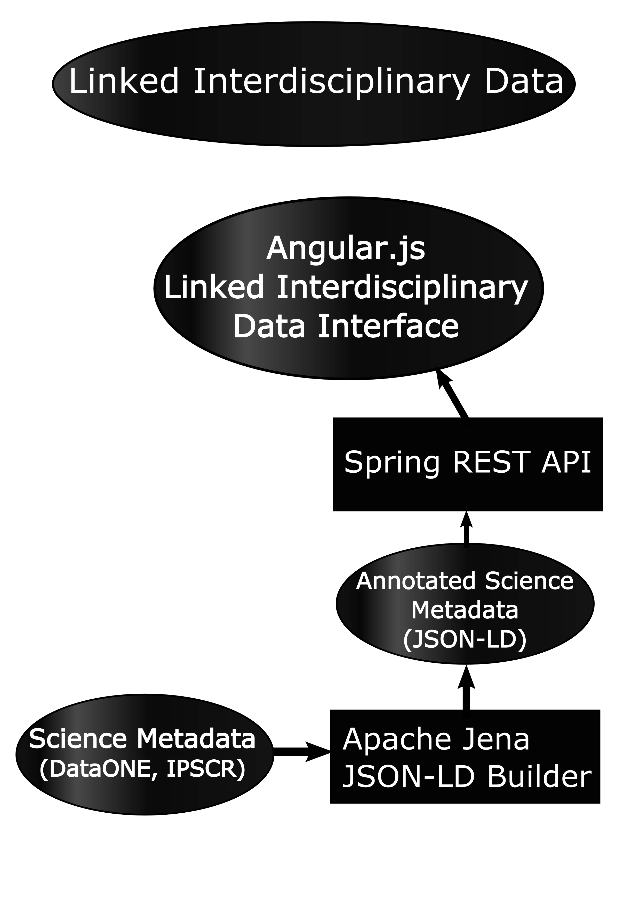

# Linked Interdisciplinary Data Discovery (LIDD) Tool, July 12, 2015

## Intro

In the proposal, I said I would "create RDF translations...of DDI and
DataONE metadata records." After a discussion with one of my mentors,
Dave Dubin, and doing more research on the current state of
Linked Data (LD) technologies I'm ready to update that plan with
something that can better demonstrate the power of linked data in
interdisciplinary research projects. Briefly, this new plan will
harness Apache Jena to build linked data annotations of the original
metadata records with links back to the originals. I will develop a
REST API to deliver JSON-LD that will drive an Angular application. To
drive the specifics of this Linked Interdisciplinary Data tool, I'll
present some user stories which help us avoid getting bogged down in
details. User Stories help us determine the Who?, What?, and most
powerfully, Why? before determining the How?  

In answering the Who, What, Why, it will pay off to focus on User
Experience (UX) and Developer Experience (DE). At worst, it seems
W3C specifications and metadata-driven data repositories' specifications 
like DataONE and ICPSR fit the more [extreme opinions of one of the
developers of the JSON-LD W3C specification](
http://manu.sporny.org/2014/json-ld-origins-2/), [Manu
Sporny](https://www.linkedin.com/in/manusporny), that

such standards have been developed and documented by people who are

> bad at explaining (the standards) to non-implementers, 
> which are most of the web developers that end up reading these specification 
> documents

This is no knock against the progress that has been made or the people
who've made it.
Amazing things are now possible because of groups like DataONE and
ICPSR. I just want to stress that it's important to
recognize that we are in a new phase of development. 
In short, there has not been enough attention given to the role of the
software developer or to modern web tools. Again from Manu Sporny's
blog post,

> your standard web developer has no interest in that toolchain because it 
> adds more complexity to the solution than is necessary.

A software developer's job is to deliver the maximum amount of quality
software. One of the [Twelve Principles of Agile
Software](http://agilemanifesto.org/principles.html) is

> Simplicity--the art of maximizing the amount of work not done--is essential.

So to ask them to learn and adopt a new database/querying tool Jena TDB
and Fuseki and a data model that may or may not be compatible
with the web developer's favorite data serialization (JSON), and
figuring out if it's compatible and how involves reading [dense
documentation](http://www.w3.org/TR/rdf-schema/), is rather extreme.
Simplicity is what I am aiming for in my choice of a toolkit for
developing a search and research data management and integration tool.
My chosen, up for revision, toolkit is described next.

### Choice of Software Toolkit

If we are serious about furthering the use of LD among software
developers who are developing applications for use in
interdisciplinary research, we need to build developer tools on the
latest and greatest software most popular among developers. Of course
popularity isn't the final say, but in many cases Darwinism works in
software ecology: the most suitable software typically has many questions
about it on Stack Overflow or the most forks on a GitHub repository
(reds flag if it doesn't have a GitHub repository, looking at you
DataONE). 

## User stories

The two data repositories we've decided to use as a proof of concept
is the ICPSR data repository, which provides DDI metadata to organize
its data, and the DataONE federated data repository that largely hosts
ecological data and although DataONE supports multiple metadata
formats, we will use the Ecological Markup Language (EML) as "the"
metadata format of DataONE. 

### Delta Smelt User Story

It's challenging to determine a specific user story for this toy
problem because the metadata records are hard to access from their
repositories. 
> One difficulty of developing a user story is questioning its
> feasibility. One main difficulty of making this metadata useful is to
> implement an effective metadata search. This reveals one of the many
> impediments to effectively linking metadata records from diverse
> repositories: often those repositories lack effective metadata search
> implementations in the first place, so fundamental tools like that are
> missing. 

## JSON-LD Annotations

I will serve JSON-LD representations of the metadata records. I'll do
this because we can use MongoDB to implement queries, which is more
familiar to developers. Unlike SPARQL, MongoDB is a very popular and
well-documented. I'll serve it with a Spring application, so we can
keep the whole build process within Java. I'll use Jena to build the
base RDF records that encode the linked data relationships. But some
of the extra things I can do might be to just include the whole
metadata record in the JSON-LD. I think JSON-LD can include the entire
metadata record itself.

## Web Interface

### Minimum Viable Product: Interdisciplinary Data Search

Users will be able to build interdisciplinary research projects and
automatically create data citations based on the datasets used in the
mashup. A search interface will provide linked data by the API
provided above. Future work will likely be providing user tools like
report building and automatic data bibliography management. 

For round one, we create the search interface. 

### Leave it cleaner than how you found it

It seems that these repositories have put a lot of work
into networking and formalization, but not into modern accessibility,
such as an intuitive REST API with a good user guide. Before creating
an integrated guide, it will be worthwhile to build interfaces for
both ICPSR and DataONE. 

The DataONE codebase is not accessible to begin with. It would be extremely
educational for developers if there were some code and developer
documentation for the
[ONEMercury](https://cn.dataone.org/onemercury/). It seemed like
more might be found at Oak Ridge's
[mercurly.ornl.gov](http://mercury.ornl.gov/), but this is a broken
link. Although we're used
to data managers preaching that data should be open, code often is not
given the first-class sharing imperative that data is. My contention
is that such things should be open. I plan to write my own search
interface with Angular which will be hosted on GitHub.

## Work Plan

I want to use Apache Jena to build my annotations. The first step,
then, is to master a few important Java tools. I'm not going to go
with Eclipse for developing in Java, but I will use [Eclim: a
"headless" Eclipse instance](http://eclim.org/) that the user interacts with through
Vim. I want to follow [Luciano Fiandesio's blog post "VIM
configuration for happy Java coding"](http://www.lucianofiandesio.com/vim-configuration-for-happy-java-coding) to set up Gradle/Eclim for
Java project management, being careful not to get too bogged down. Out
of this I just want to be able to handle dependencies efficiently and
run web apps like I do in Python. I want everything I have in my
normal Python workflow.

One of the most important things present in the two language platforms I
regularly work with is a package management system. I lately
integrated [bower](http://bower.io/) into my 
[mdedit](https://github.com/northwest-knowledge-network/mdedit) 
project to handle javascript dependencies. Bower enhancements come at the 
expense of a modest learning curve but the rewards pay of quickly. Python's 
[pip](https://pypi.python.org/pypi/pip) package
management system requires an even more modest investment to make use
of. In Java, I'm going with the [gradle](https://docs.gradle.org/current/userguide/artifact_dependencies_tutorial.html) package management system.
The packages I need are Apache Jena and Spring which I'll be using to
serve my JSON-LD API. Somehow I need to get Apache Jena to be
installed using the Gradle Maven plugin
(see [this](
https://docs.gradle.org/current/userguide/artifact_dependencies_tutorial.html)
to access the 
[Jena Maven repository](https://jena.apache.org/download/maven.html).
All this is not necessary, but it's the way to make code reusable: use
widely-used dependency management and build tools for the language of
use. This [blog
post](http://www.petrikainulainen.net/programming/gradle/getting-started-with-gradle-creating-a-multi-project-build/)
has some good introductory material on how to get started using Gradle
and Maven.

Ultimately, though, be careful to stall progress that can be made with
the software tools available. The first thing should be to put
together a prototype that compiles and does something useful. Then as
the application grows complex enough that it would benefit from having
better package and dependency management I will pursue that more
seriously. It is something I can read more about as I make concrete
progress.

The first layer of complexity is shown Figure 1. 

In wanting to use a single language for reduced complexity, here is
the [MongoDB Driver Quick Tour (for
Java)](http://mongodb.github.io/mongo-java-driver/2.13/getting-started/quick-tour/).
Use this as the JSON-LD database in the Spring Web App. [This
guide](https://spring.io/guides/gs/rest-service/) provides a hello
world REST API example in Spring, which is exactly what we need to do.
It will be worthwhile to start making wireframes and generally planning the web interface. Use
[mdedit's](https://github.com/northwest-knowledge-network/mdedit) 
Angular front end as a starting point.

To build the JSON-LD, I'll use Java's XML tools: Load the XML into a
DOM representation then use specialized XPaths to extract supported fields from
all supported metadata schema. As noted, I'll only be considering two:
EML contained in DataONE's repository and DDI from the ICPSR
repository. I will [create a Java DOM object by parsing XML files](https://docs.oracle.com/javase/tutorial/jaxp/dom/readingXML.html), [extract the supported
metadata fields](https://docs.oracle.com/javase/tutorial/jaxp/xslt/index.html), and feed them into a [Jena
RDF
representation](https://jena.apache.org/documentation/io/rdf-output.html#formats). 
Once the Jena RDF representation is made, we can convert the RDF model
to [a JSON-LD representation using the](https://spring.io/guides/gs/accessing-data-mongodb/), [made available through
Spring REST services](https://spring.io/guides/gs/accessing-mongodb-data-rest/).

